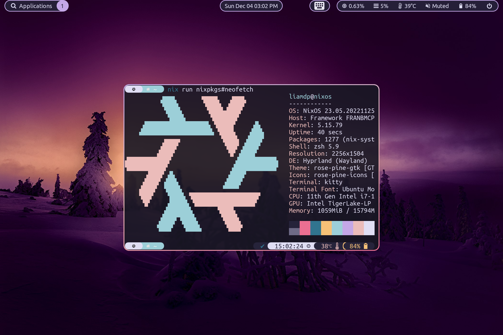
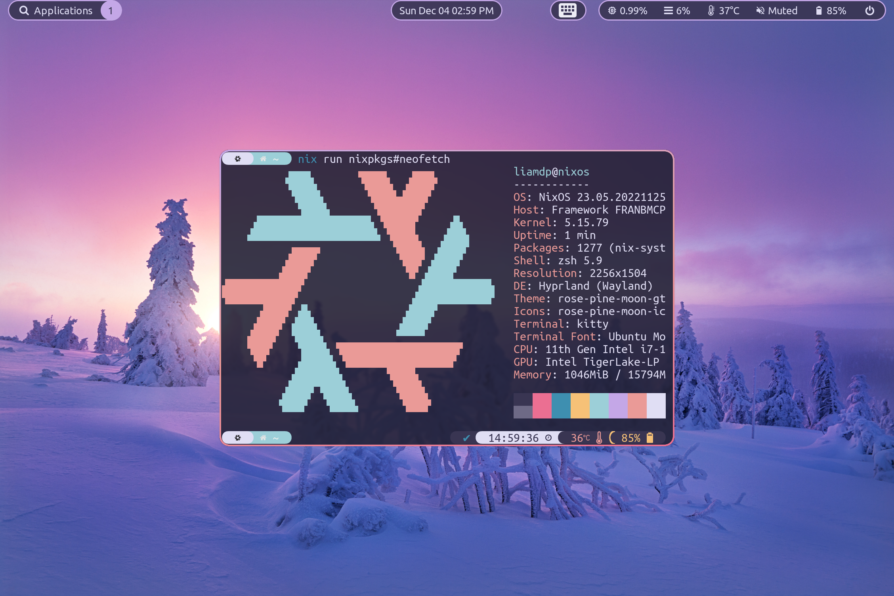
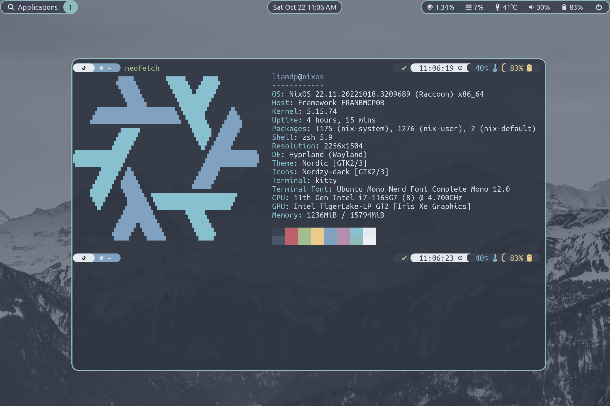
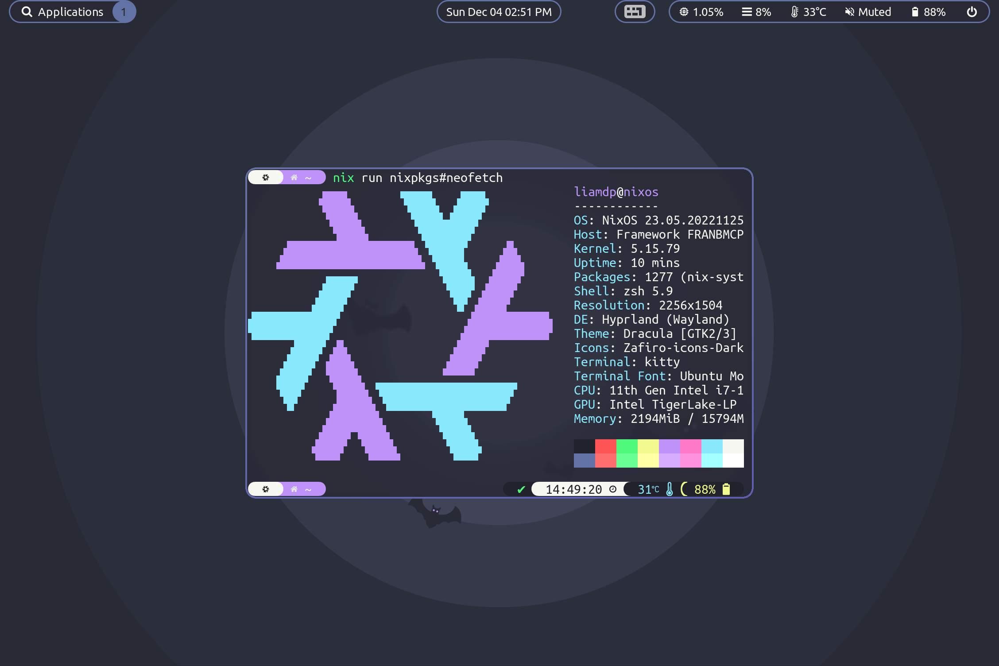
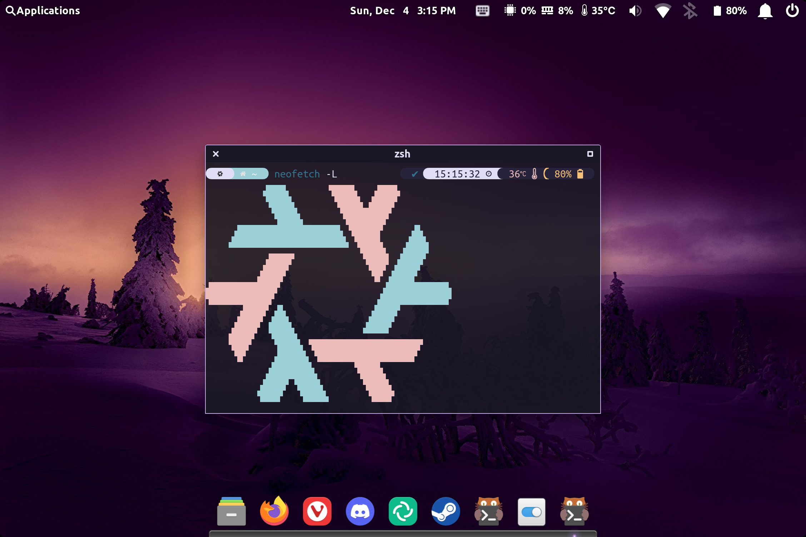
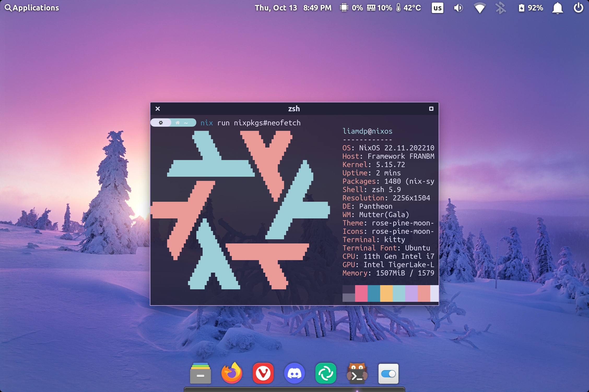
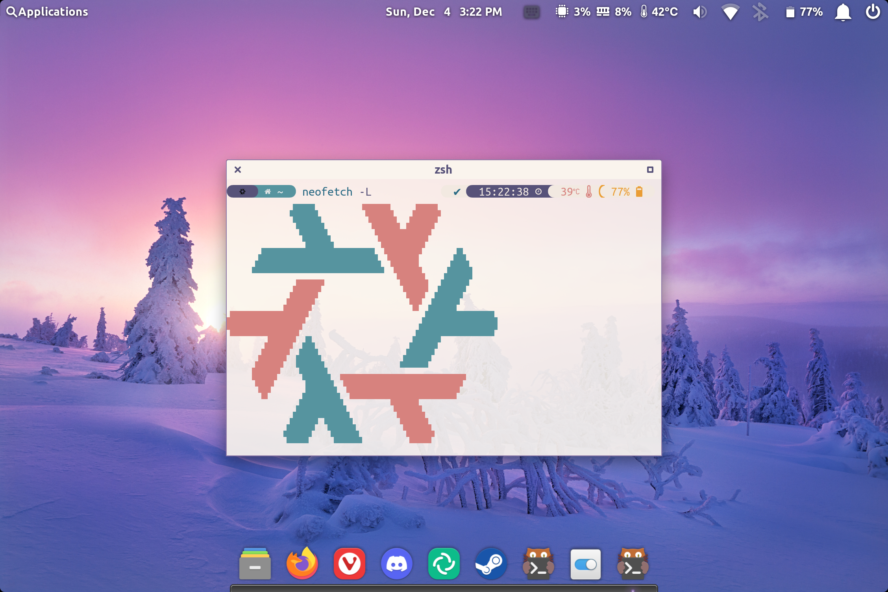
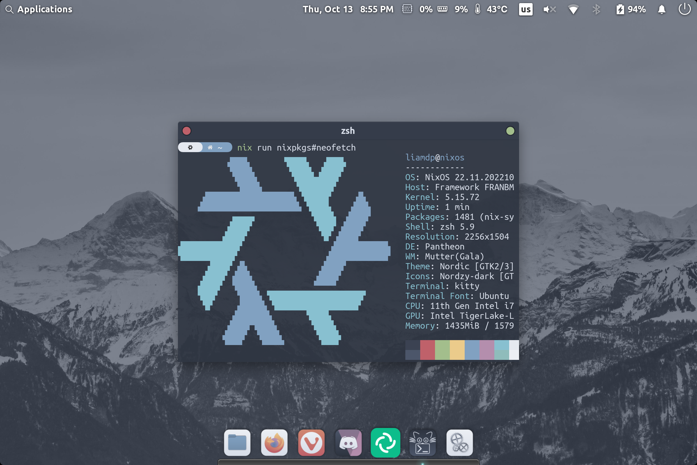
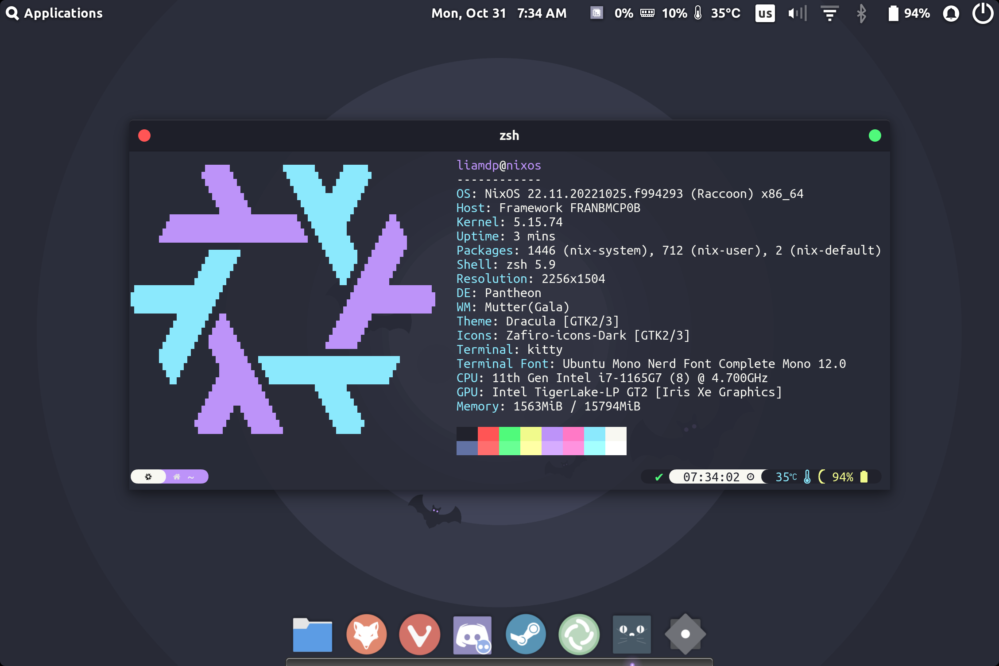

# Nix Configuration

## About
This is my NixOS configuration. I use a flake to manage everything. Five themes are available (Dracula, Nord, Rosé Pine, Rosé Pine Moon, and Rosé Pine Dawn) for two desktops (Hyprland and Pantheon). These can easily be changed from with in the flake.

## Desktops

### Hyprland

#### Rosé-Pine

#### Rosé-Pine-Moon

#### Rosé-Pine-Dawn

#### Nord

#### Dracula

---
### Pantheon

#### Rosé-Pine

#### Rosé-Pine-Moon

#### Rosé-Pine-Moon

#### Nord

#### Dracula

## TO DO

- Remove my name from most files to make it easier for others to replace my name with theirs
- Increase the amount of things managed by nix (Firefox and Discord use custom css files I need to add, for example)
- Create an ["Erase your darlings" Setup](https://grahamc.com/blog/erase-your-darlings "Erase your darlings")

## Inspiration

- [Cory Tertel's Nix Configuration](https://github.com/corytertel/nix-configuration "Cory Tertel's Nix Configuration")
- [Erik Backman's NixOS Config](https://github.com/erikbackman/nixos-config "Erik Backman's NixOS Config")
- [Alternateved's NixOS Config](https://github.com/alternateved/nixos-config "Alternateved's NixOS Config")
- [Ivan Malison's NixOS Config](https://github.com/IvanMalison/dotfiles "Ivan Malison's NixOS Config")
- [Mihai Fufezan's NixOS Config](https://github.com/fufexan/dotfiles "Mihai Fufezan's NixOS Config") 
