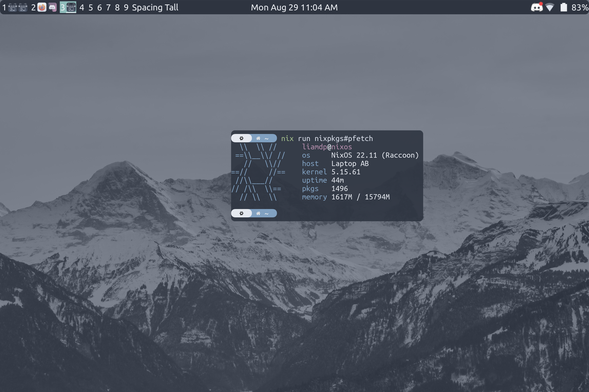
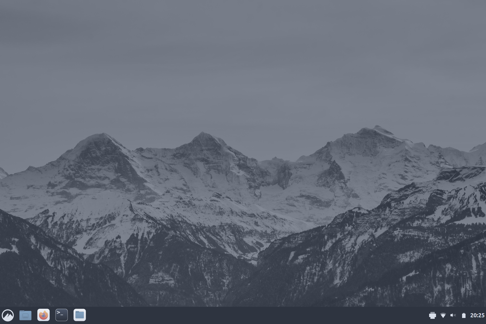
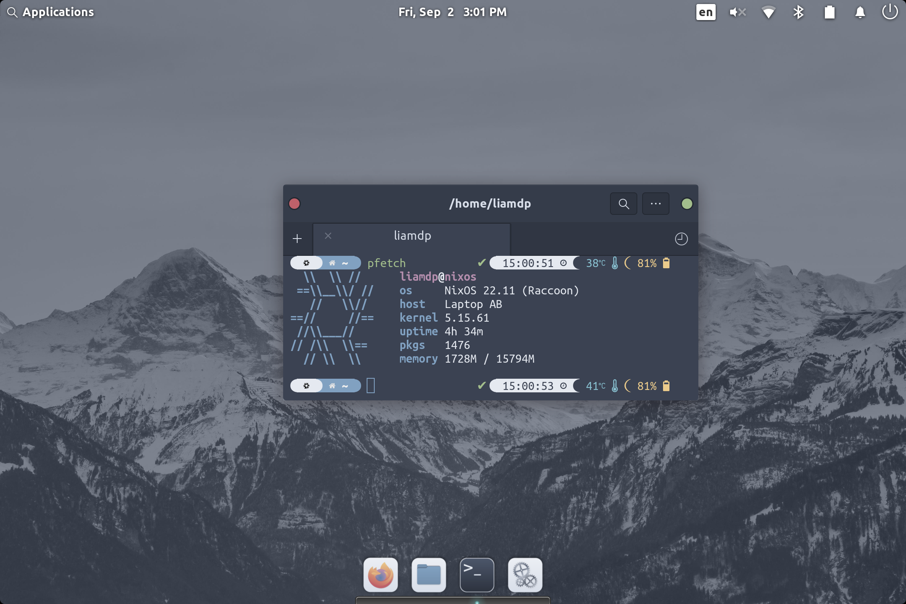

# Nix Configuration

## About
This is my NixOS configuration. I use a flake to manage everything. Currently, many things have been modularized to help organize everything.

## Desktops

### Xmonad

| **OS**              | NixOS    |
|:-------------------:|:--------:|
| **Shell**           | zsh      |
| **Terminal**        | kitty    |
| **Colorscheme**     | Nord     |
| **DM**              | LightDM  |
| **LightDM Greeter** | GTK      |
| **WM**              | xmonad   |
| **Bar**             | taffybar |
| **Font**            | Ubuntu   |
| **Editor**          | neovim   |

---
### Cinnamon

| **OS**              | NixOS    |
|:-------------------:|:--------:|
| **Shell**           | zsh      |
| **Terminal**        | kitty    |
| **Colorscheme**     | Nord     |
| **DM**              | LightDM  |
| **LightDM Greeter** | Slick    |
| **DE**              | Cinnamon |
| **WM**              | Muffin   |
| **Font**            | Ubuntu   |
| **Editor**          | neovim   |

---
### Pantheon

| **OS**              | NixOS                  |
|:-------------------:|:----------------------:|
| **Shell**           | zsh                    |
| **Terminal**        | io.elementary.terminal |
| **Colorscheme**     | Nord                   |
| **DM**              | LightDM                |
| **LightDM Greeter** | Pantheon               |
| **DE**              | Pantheon               |
| **WM**              | Gala                   |
| **Font**            | Ubuntu                 |
| **Editor**          | neovim                 |

## Inspiration

- [Cory Tertel's Nix Configuration](https://github.com/corytertel/nix-configuration "Cory Tertel's Nix Configuration")
- [Erik Backman's NixOS Config](https://github.com/erikbackman/nixos-config "Erik Backman's NixOS Config")
- [Alternateved's NixOS Config](https://github.com/alternateved/nixos-config "Alternateved's NixOS Config")
- [Ivan Malison's NixOS Config](https://github.com/IvanMalison/dotfiles "Ivan Malison's NixOS Config")
- [Icy Thought's taffybar Config](https://github.com/Icy-Thought/Snowflake/tree/935b7e2a53ed37eaa9011459f3dcacef9af31058/config/my-taffybar "Icy Thought's taffybar Config")
