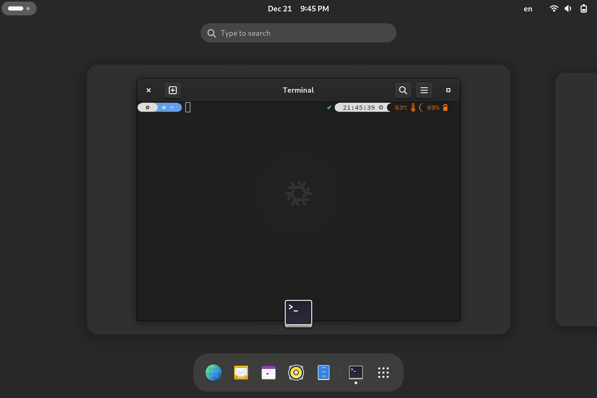
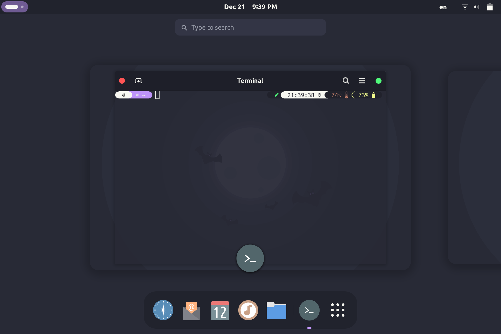
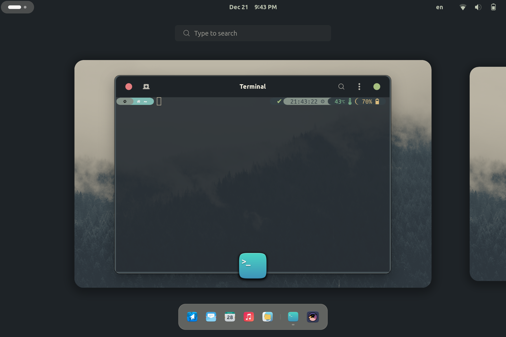
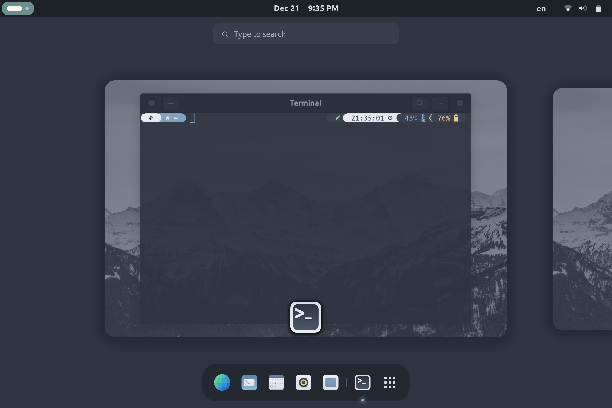

# Nix Configuration

## About
This is my NixOS configuration. I use a flake to manage everything. Four themes are available (Adwaita-Dark, Dracula, Everforest, and Nord) for one desktop (GNOME). These can easily be changed from with in the flake, which also includes user info.

You are free to copy and implement this configuration however you want, so long as you update the user info inside the flake.nix and do not file issues or bug reports. This is my personal configuration, I fix whichever bugs I want on my implementation.

## Themes

| Name | Image |
| :---: | :---: |
| Adwaita-Dark |  |
| Dracula |  |
| Everforest |  |
| Nord |  |

## TO DO

- Create an ["Erase your darlings" Setup](https://grahamc.com/blog/erase-your-darlings "Erase your darlings")

## Inspiration

- [Cory Tertel's Nix Configuration](https://github.com/corytertel/nix-configuration "Cory Tertel's Nix Configuration")
- [Erik Backman's NixOS Config](https://github.com/erikbackman/nixos-config "Erik Backman's NixOS Config")
- [Alternateved's NixOS Config](https://github.com/alternateved/nixos-config "Alternateved's NixOS Config")
- [Ivan Malison's NixOS Config](https://github.com/IvanMalison/dotfiles "Ivan Malison's NixOS Config")
- [Mihai Fufezan's NixOS Config](https://github.com/fufexan/dotfiles "Mihai Fufezan's NixOS Config")
- [Firefox themes](https://github.com/rafaelmardojai/firefox-gnome-theme "Firefox themes")
